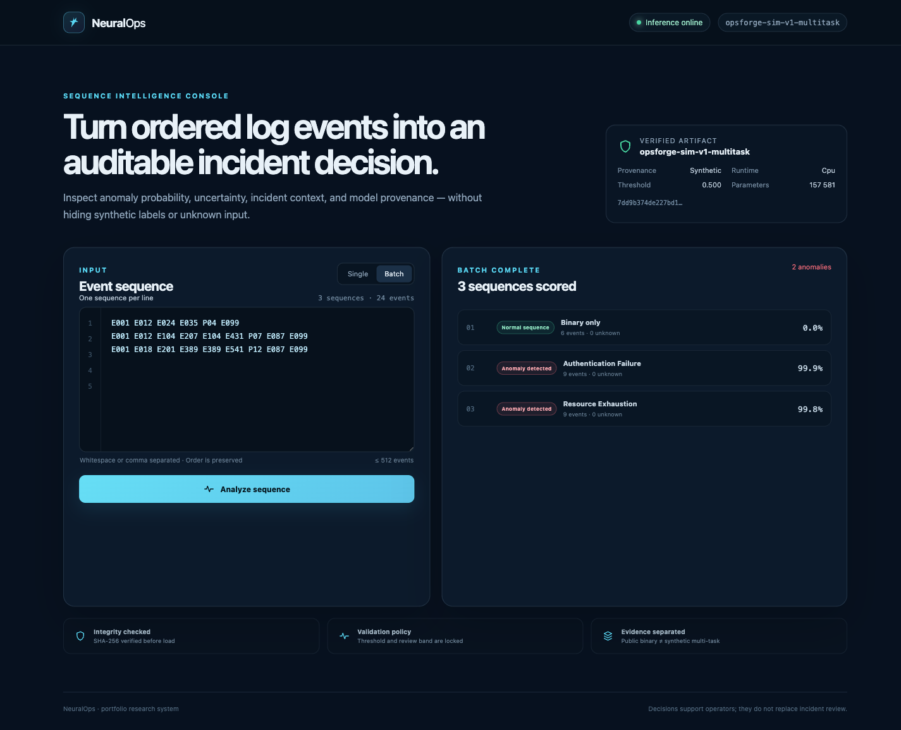
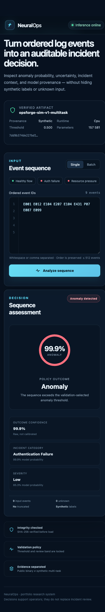

# NeuralOps

[](https://github.com/madara66613/neuralops/actions/workflows/ci.yml)
[](https://www.python.org/)
[](https://pytorch.org/)
[](LICENSE)

NeuralOps is a production-minded log-sequence anomaly detection system: reproducible data preparation, a transparent statistical baseline, a PyTorch GRU, calibrated decision policy, FastAPI inference, and a React operator console.

The repository deliberately separates two evidence tracks:

- **Public benchmark — HDFS v1:** binary anomaly detection at HDFS block/session level. HDFS does not provide incident category or severity labels, so NeuralOps does not invent them.
- **Product demonstration — OpsForge Sim v1:** clearly labeled synthetic operations sequences with anomaly category and severity targets. Its metrics never stand in for real-world performance.

## Current status

Development is organized as small reviewable milestone pull requests. The data, baseline, GRU, synthetic multi-task profile, shared predictor, inference API, and operator console are implemented. Numerical claims come only from generated, versioned evaluation artifacts.

## Operator console

The React/TypeScript console handles individual and batch sequences, example inputs, loading/offline/error states, raw confidence disclosure, unknown-token diagnostics, and artifact provenance. It is responsive and keyboard operable.


<details>
<summary>Batch and mobile views</summary>





</details>

### Verified baseline

| Profile | Model | Test samples | Precision | Recall | F1 | PR-AUC | ROC-AUC |
| --- | --- | ---: | ---: | ---: | ---: | ---: | ---: |
| HDFS v1 deduplicated sequence | TF-IDF + logistic regression | 2,740 | 0.9527 | 0.9788 | 0.9656 | 0.9934 | 0.9981 |
| HDFS v1 deduplicated sequence | Packed bi-GRU | 2,740 | 0.9820 | 0.9939 | 0.9879 | 0.9990 | 0.9997 |

These are not conventional all-block HDFS numbers: 575,061 block traces were reduced to 18,383 deterministic `(fingerprint, label)` representatives before splitting. Exact values, confusion matrices, hashes, environment, and reproduction commands are in the machine-readable [baseline](reports/hdfs-v1-deduplicated-baseline.json) and [GRU](reports/hdfs-v1-deduplicated-gru.json) reports.

### Synthetic multi-task demonstration

OpsForge Sim v1 produces 5,615 deduplicated synthetic records from 6,000 generated examples. The locked test artifact reached binary F1 `1.0`, category macro-F1 `1.0`, and severity macro-F1 `0.6856`. The perfect binary/category scores reflect deliberately separable authored patterns, not production capability. See the [methodology](docs/SYNTHETIC_DATA.md) and [exact synthetic report](reports/opsforge-sim-v1-multitask.json).

## Research contract

- Split by block/session group, never by individual log line.
- Assign duplicate normalized sequences to one split before measuring performance.
- Fit event vocabulary and transforms on training data only.
- Select thresholds and uncertainty policy on validation data only.
- Touch the test set once for the final report associated with an artifact.
- Report dataset identity, split manifest, seed, model hash, and measurement hardware beside metrics.

See [dataset evidence](docs/DATASETS.md), [architecture](docs/ARCHITECTURE.md), and [acceptance criteria](docs/ACCEPTANCE.md).

## Command surface

```bash
neuralops download-hdfs
neuralops prepare --config configs/hdfs-binary.yaml
neuralops train-baseline --config configs/hdfs-binary.yaml
neuralops train-baseline --config configs/hdfs-binary.yaml \
  --artifact artifacts/hdfs-v1-deduplicated/baseline
neuralops train --config configs/hdfs-binary.yaml \
  --artifact artifacts/hdfs-v1-deduplicated/gru --device cpu
neuralops evaluate --artifact artifacts/hdfs-v1-deduplicated/gru \
  --processed-dir data/processed/hdfs-v1 --split test --device cpu
neuralops benchmark --artifact artifacts/hdfs-v1-deduplicated/gru \
  --processed-dir data/processed/hdfs-v1 --batch-size 32 --device cpu
neuralops prepare --config configs/opsforge-sim.yaml
neuralops train --config configs/opsforge-sim.yaml \
  --artifact artifacts/opsforge-sim-v1/multitask-gru --device cpu
neuralops predict --artifact artifacts/opsforge-sim-v1/multitask-gru \
  --events E001 E012 E104 E207 E104 E431 P07 E087 E099 --device cpu
neuralops serve --artifact artifacts/opsforge-sim-v1/multitask-gru \
  --host 127.0.0.1 --port 8000 --device cpu
```

Start the console in a second terminal:

```bash
cd frontend
npm ci
npm run dev
```

See the [HTTP API contract](docs/API.md) for endpoints, payload limits, provenance behavior, and error schemas. The [console guide](docs/UI.md) documents UI states, accessibility, testing, and configuration.

## License and data

NeuralOps source code is MIT licensed. Loghub data is a separate CC BY 4.0 dataset and is not bundled here. The official record, required attribution, checksum, and citations are documented in [docs/DATASETS.md](docs/DATASETS.md).
