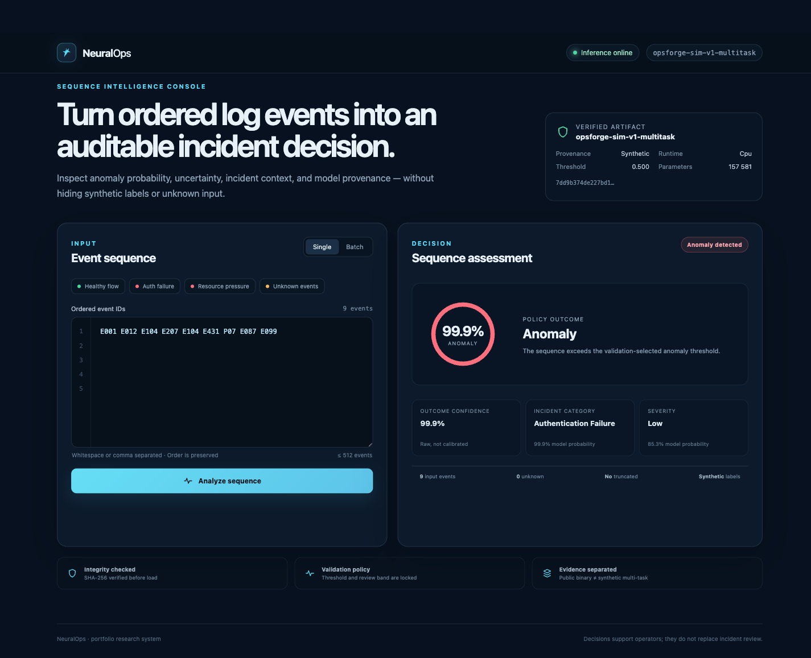

# NeuralOps

[](https://github.com/madara66613/neuralops/actions/workflows/ci.yml)

Log-sequence anomaly detection with a TF-IDF/logistic baseline, a packed bidirectional PyTorch GRU, and a FastAPI/React inference interface. Inputs are ordered event-template IDs. Public HDFS binary evaluation is kept separate from the synthetic category/severity experiment.



## Quick start

Requires a running Docker engine with Compose. The bundled model uses synthetic data; no GPU, API key, or model download is needed.

```bash
git clone https://github.com/madara66613/neuralops.git
cd neuralops
docker compose up --build
```

Open the [console](http://127.0.0.1:4173). It supports single/batch predictions, a validation-selected review band, provenance, unknown/truncated-input diagnostics, and leave-one-event-out sensitivity. See [deployment](docs/DEPLOYMENT.md) and [API contracts](docs/API.md).

## Committed evaluation results

HDFS v1 preparation reduces 575,061 block traces to 18,383 `(fingerprint, label)` representatives before grouped splitting. The test split contains 2,740 sequences. These results describe that deduplicated population, rather than conventional all-block HDFS evaluation.

| Model | Precision | Recall | F1 | PR-AUC | ROC-AUC | FP / FN |
| --- | ---: | ---: | ---: | ---: | ---: | ---: |
| TF-IDF + logistic regression | 0.952733 | 0.978756 | 0.965569 | 0.993398 | 0.998064 | 32 / 14 |
| Packed bidirectional GRU | 0.982009 | 0.993930 | 0.987934 | 0.998994 | 0.999681 | 12 / 4 |

Values are rounded here. Exact metrics, hashes, commands, and recorded CPU timings are in the [baseline report](reports/hdfs-v1-deduplicated-baseline.json), [GRU report](reports/hdfs-v1-deduplicated-gru.json), and [experiment comparison](reports/experiments.md).

The separate OpsForge Sim test has 806 sequences: binary F1 `1.0`, category macro-F1 `1.0`, and severity macro-F1 `0.6856184110306733`. Category/severity metrics cover 341 anomalous sequences. The authored patterns make anomaly/category classification easy; these scores do not establish performance on real incidents. See the [synthetic report](reports/opsforge-sim-v1-multitask.json).

## Data and model decisions

- Group/fingerprint components stay in one split, including conflicting labels. Vocabulary and transforms are fitted on training data only.
- The training loop uses class-weighted losses, AdamW, gradient clipping, early stopping, and checkpoint restoration. Thresholds and the review band are selected on validation data before test evaluation.
- The shared GRU encoder has a binary head; category/severity heads are trained only for the synthetic profile. HDFS has no category/severity labels.
- Model loading checks artifact hashes. CLI and API share the predictor; reported probabilities are uncalibrated and sensitivity is descriptive rather than causal.

See [architecture](docs/ARCHITECTURE.md), [dataset provenance](docs/DATASETS.md), and the [model card](reports/model-card.md).

## Local Python and frontend development

Use Python 3.12/3.13 and Node.js 22+:

```bash
python3 -m venv .venv
source .venv/bin/activate
python -m pip install -e '.[dev]'
neuralops predict --artifact demo/artifact \
  --events E001 E012 E104 E207 E104 E431 P07 E087 E099 --device cpu
neuralops serve --artifact demo/artifact --host 127.0.0.1 --port 8000 --device cpu
```

In another terminal:

```bash
npm --prefix frontend ci
npm --prefix frontend run dev
```

<details>
<summary>Reproduce the public HDFS experiment</summary>

After Python setup, allow space for the 1.47 GiB expanded archive:

```bash
neuralops download-hdfs
neuralops prepare --config configs/hdfs-binary.yaml
neuralops train-baseline --config configs/hdfs-binary.yaml \
  --artifact artifacts/hdfs-v1-deduplicated/baseline
neuralops train --config configs/hdfs-binary.yaml \
  --artifact artifacts/hdfs-v1-deduplicated/gru --device cpu
neuralops evaluate --artifact artifacts/hdfs-v1-deduplicated/gru \
  --processed-dir data/processed/hdfs-v1 --split test --device cpu
```

Retraining creates a new artifact; the committed reports describe their recorded artifacts. Dataset download includes checksum verification. Full methodology is in the [dataset guide](docs/DATASETS.md).

</details>

## Tests and CI

```bash
ruff check .
ruff format --check .
mypy neuralops
pytest --cov=neuralops --cov-report=term-missing
npm --prefix frontend run lint
npm --prefix frontend run typecheck
npm --prefix frontend test
npm --prefix frontend run build
cd frontend
npx playwright install chromium
npm run test:e2e
```

Python tests include fixture training, splitting, artifact/policy checks, and API behavior. Browser tests use mocked API responses. Separate Docker CI checks artifact checksums, builds both images, starts Compose, and exercises live inference.

## Limits

New log sources need compatible parsing, grouping, training, and domain evaluation. There is no distribution-shift benchmark or probability calibration. The HDFS model has a 128-event limit; [error analysis](reports/error-analysis.md) records truncation and the 12 false positives/four false negatives. Sensitivity scores do not identify root causes, and the application performs no incident remediation.

Code and the synthetic demo artifact use the [MIT license](LICENSE). HDFS is a separate CC BY 4.0 dataset and is not bundled.
