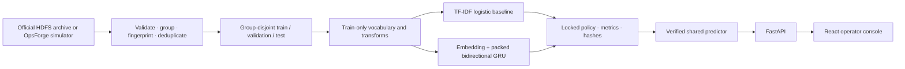

# NeuralOps

[](https://github.com/madara66613/neuralops/actions/workflows/ci.yml)
[](https://github.com/madara66613/neuralops/releases)
[](https://www.python.org/)
[](https://pytorch.org/)
[](LICENSE)

NeuralOps is an independently runnable, end-to-end log-sequence intelligence project: checksum-verified data preparation, leakage-safe splits, a statistical baseline, a hand-written PyTorch training loop, multi-task experimentation, artifact integrity checks, FastAPI inference, leave-one-event-out sensitivity, and a recruiter-friendly React console.

It is a portfolio research system—not a commercially deployed detector, autonomous incident responder, or root-cause engine.

## Run the complete demo

Docker is the fastest path; no API key, paid service, GPU, or model download is required:

```bash
git clone https://github.com/madara66613/neuralops.git
cd neuralops
docker compose up --build
```

Open [http://127.0.0.1:4173](http://127.0.0.1:4173). The bundled 660 KiB artifact is synthetic and identified as such throughout the UI and API. See [deployment details](docs/DEPLOYMENT.md).


<details>
<summary>Batch and mobile views</summary>


</details>

## Recruiter demo flow

1. Start the stack and open the console.
2. Run **Healthy flow**, then **Auth failure**; compare thresholded decisions and category/severity fields.
3. Inspect model provenance, raw uncalibrated confidence, unknown/truncation diagnostics, and leave-one-event-out score changes.
4. Switch to **Batch** and score three ordered sequences with the keyboard.
5. Open `/api/model` and the committed reports to connect the UI result to a verified artifact, split manifest, and actual experiment.

An exact demo input is:

```text
E001 E012 E104 E207 E104 E431 P07 E087 E099
```

The bundled artifact returns this generated prediction excerpt:

```json
{
  "predicted_anomaly": true,
  "anomaly_probability": 0.9992861151695251,
  "confidence_kind": "raw_model_outcome_probability_not_calibrated",
  "decision": "anomaly",
  "category": "authentication_failure",
  "severity": "low",
  "profile": "opsforge-sim-v1-multitask",
  "label_provenance": "synthetic"
}
```

## Honest problem formulation

NeuralOps has two evidence tracks that are never merged:

- **Public evaluation — LogPAI HDFS v1:** ordered event-template IDs for one HDFS block/session → normal or anomalous. Upstream data has no credible incident category or severity label, so those outputs are absent.
- **Product behavior — OpsForge Sim v1:** reproducibly generated, grouped operations scenarios → anomaly, one of nine synthetic categories, and synthetic severity. These results demonstrate the contract, not real-world generalization.

The current predictor consumes parsed event IDs, not arbitrary raw log messages. Adapting a new application requires a compatible parser, grouping rule, labels, training, and domain evaluation.

## Results

### Public HDFS v1 deduplicated-sequence test

| Model | Samples | Precision | Recall | F1 | PR-AUC | ROC-AUC | FP | FN |
| --- | ---: | ---: | ---: | ---: | ---: | ---: | ---: | ---: |
| TF-IDF + logistic regression | 2,740 | 0.9527326440177253 | 0.9787556904400607 | 0.9655688622754491 | 0.993398403251326 | 0.9980636279248842 | 32 | 14 |
| Packed bidirectional GRU | 2,740 | 0.9820089955022488 | 0.9939301972685888 | 0.9879336349924586 | 0.9989935365790357 | 0.9996809780520192 | 12 | 4 |

These are not conventional all-block HDFS results. NeuralOps reduces 575,061 block traces to 18,383 deterministic `(fingerprint, label)` representatives before grouped splitting. Exact unrounded metrics, confusion matrices, hashes, runtime, and commands are in the [baseline JSON](reports/hdfs-v1-deduplicated-baseline.json), [GRU JSON](reports/hdfs-v1-deduplicated-gru.json), and [experiment table](reports/experiments.md).

The HDFS GRU has 151,233 parameters and a 608,544-byte state artifact. On the recorded Apple M3 CPU environment, batch-1 p50 model latency was `0.265417` ms and batch-32 throughput was `6582.435206503571` sequences/s. Timings exclude API/network/UI overhead and do not generalize across hardware.

### Synthetic multi-task test

OpsForge Sim v1 generates 6,000 records and retains 5,615 after deduplication. The locked 806-record test split produced binary F1 `1.0`, category macro-F1 `1.0`, and severity macro-F1 `0.6856184110306733`. Perfect binary/category scores reflect deliberately separable authored patterns. See the [synthetic methodology](docs/SYNTHETIC_DATA.md) and [exact report](reports/opsforge-sim-v1-multitask.json).

## Implemented architecture



The GRU is repository code rather than a hosted model or high-level trainer. Its shared encoder feeds a binary head and, only for the synthetic profile, masked category/severity heads. Training includes forward/backward passes, class-weighted losses, AdamW, gradient clipping, seeded loaders, early stopping, checkpoint restoration, and validation-only threshold selection. See [architecture](docs/ARCHITECTURE.md) and the [model card](reports/model-card.md).

## Data and leakage controls

- Official HDFS v1 is downloaded from Zenodo DOI `10.5281/zenodo.8196385`, checksum-verified, and kept out of Git.
- Complete block/session sequences are normalized and fingerprinted before splitting; individual log lines are never randomly split.
- Duplicate components and conflicting identical fingerprints cannot cross splits.
- Vocabulary, TF-IDF, class weights, label mappings, and sequence limits are learned from training data only.
- Early stopping, decision threshold, and manual-review band use validation only.
- The locked checkpoint is evaluated once on its untouched test split.
- Data-quality artifacts prove group and fingerprint disjointness and record class balance, length, duplicates, unknowns, and hashes.

HDFS is CC BY 4.0 and is not redistributed here. Exact source, archive checksum, original labels, attribution, and alternatives are documented in [dataset evidence](docs/DATASETS.md).

## Reproduce the public experiment

Requirements: Python 3.12 and enough disk for the 1.47 GiB expanded HDFS archive.

```bash
python3.12 -m venv .venv
source .venv/bin/activate
python -m pip install --upgrade pip
python -m pip install -e '.[dev]'

neuralops download-hdfs
neuralops prepare --config configs/hdfs-binary.yaml

neuralops train-baseline --config configs/hdfs-binary.yaml \
  --artifact artifacts/hdfs-v1-deduplicated/baseline

neuralops train --config configs/hdfs-binary.yaml \
  --artifact artifacts/hdfs-v1-deduplicated/gru --device cpu

neuralops evaluate --artifact artifacts/hdfs-v1-deduplicated/gru \
  --processed-dir data/processed/hdfs-v1 --split test --device cpu

neuralops benchmark --artifact artifacts/hdfs-v1-deduplicated/gru \
  --processed-dir data/processed/hdfs-v1 --batch-size 32 --device cpu

neuralops analyze-errors --artifact artifacts/hdfs-v1-deduplicated/gru \
  --processed-dir data/processed/hdfs-v1 --split test --device cpu \
  --output reports/hdfs-v1-error-analysis.json
```

The committed test report belongs to the locked artifact. Rerunning training can produce a new artifact; do not overwrite or reinterpret the existing test claim while tuning.

## CLI, API, and console

```bash
neuralops predict --artifact demo/artifact \
  --events E001 E012 E104 E207 E104 E431 P07 E087 E099 --device cpu

neuralops serve --artifact demo/artifact \
  --host 127.0.0.1 --port 8000 --device cpu
```

The API provides `/health`, `/ready`, `/version`, `/model`, `/predict`, `/predict/sensitivity`, and `/predict/batch`. Requests are strictly validated and size-limited; responses include request IDs, software version, inference time, model provenance, nullable auxiliary labels, uncertainty state, and safe errors. Payloads are not logged. See the [API contract](docs/API.md) and [security policy](SECURITY.md).

For non-Docker frontend development:

```bash
cd frontend
npm ci
npm run dev
```

The responsive console supports samples, pasted event IDs, batch input, loading/empty/offline/error states, keyboard operation, artifact provenance, and leave-one-event-out score sensitivity with a non-causal disclaimer. See the [UI guide](docs/UI.md).

## Testing and CI

```bash
ruff check .
mypy neuralops
pytest --cov=neuralops --cov-report=term-missing

cd frontend
npm run lint
npm run typecheck
npm test
npm run build
npm run test:e2e

cd ..
docker compose build
docker compose up --detach --wait
```

GitHub Actions runs Python lint/type/tests and fixture training, Biome, TypeScript, Vitest, the production Vite build, Playwright Chromium, artifact checksum verification, both Docker builds, Compose health checks, and live inference smoke tests—without a GPU.

## Apple Silicon

Runtime selection is CUDA → Apple MPS → CPU, and explicit unavailable devices fail loudly. A public MPS training attempt was stopped after PyTorch reported a nondeterministic backward operation, so the publishable HDFS artifact was trained and benchmarked on CPU. This preserves the stated determinism contract; MPS remains useful for local experiments but should be validated per operation and PyTorch release.

## Error analysis and limitations

The locked HDFS test contains 12 false positives and 4 false negatives. Seven false positives and one false negative fall in the manual-review band; three false negatives remain confidently below it. One 222-event false positive is truncated to the 128-event model limit. Full cases, template frequencies, leakage audit, blind spots, and next experiments are in the [error analysis](reports/error-analysis.md) and its [machine-readable JSON](reports/hdfs-v1-error-analysis.json).

Known limitations include HDFS age and domain narrowness, uncalibrated probabilities, parser dependence, a closed event vocabulary, no time/host distribution-shift benchmark, no public category/severity labels, easy synthetic category patterns, and no autonomous remediation. Leave-one-out score changes show model sensitivity only; they are not causal explanations.

## Repository map

```text
configs/            reproducible public and synthetic experiment configs
neuralops/data/     download, parsing, grouping, splitting, vocabulary
neuralops/modeling/ PyTorch model, training, benchmark, error analysis
neuralops/api/      strict FastAPI schemas, logging, service factory
frontend/           React, TypeScript, Vite, Vitest, Playwright, nginx
demo/artifact/      small checked-in synthetic artifact + SHA256SUMS
reports/            exact JSON evidence, model card, experiments, errors
tests/              data, leakage, model, checkpoint, policy, API tests
output/playwright/  reviewed desktop, batch, and mobile screenshots
```

Development is delivered through focused milestone pull requests covering research, data/baseline, GRU, synthetic multi-task learning, API, UI, and release packaging. [Acceptance criteria](docs/ACCEPTANCE.md) are evidence-based.

## CV-ready description

> Built NeuralOps, an end-to-end PyTorch log-sequence anomaly system with duplicate-safe grouped splits, a TF-IDF baseline, packed bidirectional GRU and masked multi-task heads, validation-selected uncertainty policy, SHA-256-verified artifacts, FastAPI/React inference, Docker Compose, Playwright, and multi-stage GitHub Actions; documented exact HDFS benchmark evidence separately from synthetic product labels.

## License and disclaimer

NeuralOps source code and the authored synthetic demo artifact are MIT licensed. Loghub HDFS data remains a separate CC BY 4.0 dataset and is not bundled. This repository is experimental portfolio software for learning and evaluation; operators remain responsible for every incident decision.
