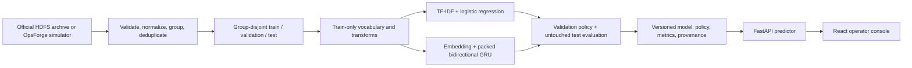

# Architecture and scientific design

## System boundary

## Prediction tasks

### HDFS public track

- Input: ordered event IDs for one HDFS block.
- Output: anomaly probability, binary decision, confidence band, and manual-review flag.
- Target: upstream binary anomaly label only.
- Explicitly absent: category and severity.

### OpsForge synthetic track

- Shared encoder with binary, category, and severity heads.
- Category and severity losses apply only to anomalous sequences.
- API fields are nullable and model metadata declares `label_provenance=synthetic`.
- Public and synthetic metrics live in separate report sections and artifact directories.

## Leakage controls

1. Normalize and fingerprint complete sequences before splitting.
2. Deduplicate identical `(fingerprint, label)` records, retaining a deterministic representative.
3. Assign clusters deterministically using a seeded stable hash of the cluster ID.
4. Assert block/session groups and fingerprints are disjoint across all splits.
5. Fit vocabulary, TF-IDF, class weights, and sequence-length limits on train only.
6. Select early stopping, decision threshold, and uncertainty band using validation only.
7. Evaluate the locked artifact once against test; record the manifest hash.

If identical normalized sequences carry conflicting upstream labels, NeuralOps keeps
one representative for each label, places both in the same component/split, and
reports the conflict count. It does not hide ambiguity or let identical features
leak across boundaries. This deduplicated-sequence profile is reported explicitly;
it is not presented as the conventional all-block HDFS benchmark.

The default target ratios are 70/15/15. Realized ratios and class balance are reported rather than assumed because group constraints take priority over exact percentages.

## Model design

The primary neural model uses a train-only event vocabulary with reserved padding and unknown tokens, a learned embedding, packed variable-length sequences, a bidirectional GRU, dropout, and a small classification head. Training includes seeded loaders, class-weighted loss, AdamW, gradient clipping, early stopping, and best-checkpoint restoration.

Runtime device resolution is CUDA, then Apple MPS, then CPU. An explicit unavailable device fails loudly.

## Decision policy

The validation set selects a binary threshold by the configured objective. A second validation-only search chooses a low/high probability band for manual review while preserving minimum automatic-decision coverage. The artifact stores both values and their selection criterion. API consumers never silently substitute `0.5`.

## Artifact contract

Every publishable artifact contains:

- model state or serialized baseline;
- architecture config and package version;
- vocabulary and label mappings;
- decision and uncertainty thresholds;
- dataset DOI/source, split manifest hash, seed, and label provenance;
- validation and test metrics in separate objects;
- parameter count, serialized size, and benchmark context;
- SHA-256 hashes for integrity checks.

## Serving constraints

The API validates event count, event length, batch size, and body size. It returns request IDs, structured errors, model provenance, and nullable multi-task fields. `/health` proves process liveness; `/ready` only succeeds when a verified model is loaded.
